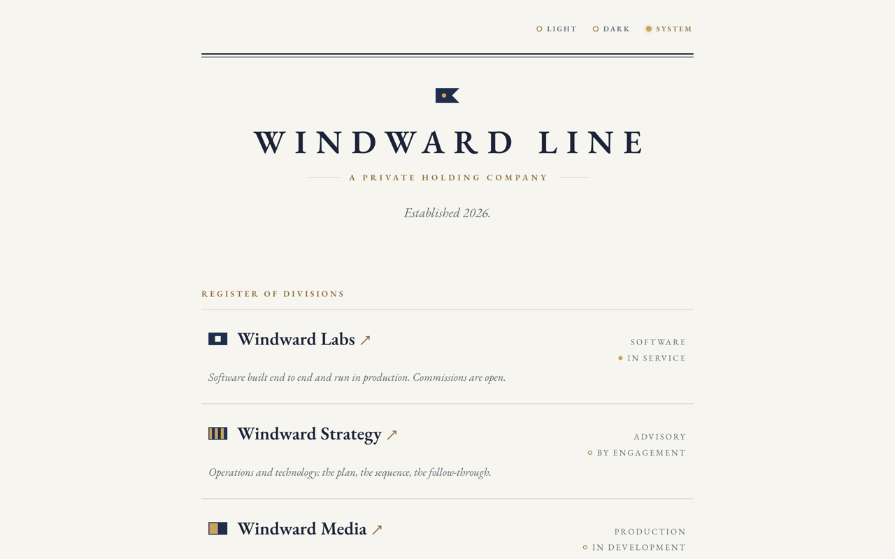

# windwardline.com

The apex site for Windward Line, a private holding company. Three divisions
on the register — Labs, Strategy, Media. Every division flies at its own
subdomain, and the footer musters the register's flags beneath the house flag.

Static site, no build step: one HTML file, one stylesheet, self-hosted
EB Garamond, and the house and division flags as inline SVG. Light and dark themes follow the
OS unless the lamp (light / dark / system) has stored a choice. Design spec: [docs/superpowers/specs/2026-07-25-apex-redesign-design.md](docs/superpowers/specs/2026-07-25-apex-redesign-design.md).

Deployed on Vercel; DNS on Cloudflare. Pushes to `main` deploy to production.
Security headers are set in [vercel.json](vercel.json).

EB Garamond is licensed under the SIL Open Font License 1.1
([fonts/OFL.txt](fonts/OFL.txt)). Everything else is proprietary
([LICENSE](LICENSE)).
